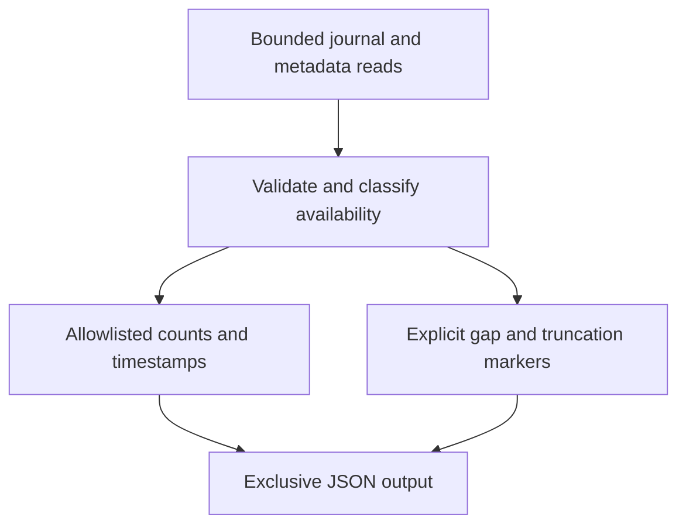

# Boot reset evidence collection - Plan

## Goal Capsule

- Objective: make existing boot-reset evidence and its gaps reproducible for maintainers investigating companion issue #13.
- Means: a bounded, read-only summary collector, synthetic regressions and a proposed boot matrix.
- Authority: issue #13 and repository safety instructions govern the work. This contribution does not authorize reboot, module changes or decoder access.
- Stop conditions: stop before any privileged or hardware mutation. Keep issue #13 open for the approved hardware campaign and unresolved cause.

## Product Contract

### Summary

Add a repeatable way to summarize retained kernel journals and crash-record availability without publishing raw logs.
Document the available M2 evidence, its limits, competing explanations and a concrete cold/warm boot matrix for later approval.

### Problem Frame

The repository records two historical resets shortly after boot with patches 0001-0005 loaded, followed by one successful boot with all 15 patches.
The cause remains unknown, and evidence from another device or a successful short run cannot establish boot reliability.

### Requirements

**Evidence collection**

- R1. Produce a versioned JSON record with a public device pseudonym, collection time, collector identity, current kernel/module provenance and per-boot journal availability.
- R2. Summarize bounded kernel journal input as fixed event categories, counts and timestamps, never raw messages, hostnames, credentials, command lines, arbitrary identifiers or pstore contents.
- R3. Distinguish empty, inaccessible, missing, failed and truncated evidence from a completed collection; no absence of matches may become a clean-boot or no-fault verdict.
- R4. Report current module presence separately from the file selected for a future load, leaving loaded-binary identity unknown without independent evidence.

**Investigation and handoff**

- R5. Separate direct observations, historical reports, unknowns and hypotheses in the research record; correlate time without inferring cause.
- R6. Define a proposed, unexecuted cold/warm boot matrix with blacklisted control and a proposed patched configuration pending approval, fixed power/peripheral state, recovery steps and per-attempt records.
- R7. Preserve all system configuration and shipped patches, require the existing consent/save-work gates before any later boot/module operation, and leave support experimental.

### Scope Boundaries

The collector reads ordinary journal/proc/sys/package metadata and directory availability only.
It never opens a video node, invokes decoding tools, writes system state, escalates privileges, loads or unloads a module, reboots or suspends.
Hardware execution, causal diagnosis, kernel changes and support promotion remain follow-up work under #13.

## Planning Contract

### Key Technical Decisions

- KTD1. Use a small Python standard-library collector with injectable command and filesystem access, following `tools/qualify-device.py` and `tests/qualify-device-test.py`; prefer reusing its inventory/provenance functions without modifying their established behavior.
- KTD2. Read a finite recent boot window (default six, maximum sixteen) and bound each journal query by a finite timeout, entry limit and byte limit. A reached limit marks possible truncation. Treat nonempty stderr or malformed JSON conservatively as incomplete and never publish stderr. Do not suppress permission warnings with quiet mode.
- KTD3. Use fixed event classes for AVD activity, AVD errors/timeouts, reset-reason evidence, panic/oops/watchdog and shutdown markers. Exclude blacklist/kernel-command-line mentions from evidence of module load, and ARM performance-counter PMU initialization from reset-reason evidence. Preserve first/last event timestamps and counts without printing messages.
- KTD4. Inspect live and archived pstore directories for availability and bounded entry counts only; permission errors and empty archives remain distinct. Pstore presence is a lead, not a reset explanation.
- KTD5. Require an explicit new output path and refuse overwriting existing files or symlinks, as the existing inventory collector does. Exit 0 means collection completed, 2 means usable evidence with gaps, and 1 means no usable output; none is a hardware verdict.

### Assumptions

The intended first contribution is offline tooling and research, not completion of the full hardware issue.
The current host may retain accessible journals while pstore access is denied; such gaps should produce useful partial records.
Raw logs stay private, and maintainers can request narrowly scoped redacted excerpts separately if summary categories prove insufficient.

### High-Level Technical Design

## Implementation Units

### U1. Collect bounded boot evidence

**Goal:** implement R1-R4 and the collector side of R7.

**Dependencies:** none.

**Files:** `tools/collect-boot-evidence.py`, `tests/boot-evidence-test.py`, `.github/workflows/checks.yml`.

**Approach:** follow KTD1-KTD5. Keep parsing and aggregation testable with synthetic journal records and temporary filesystem fixtures. Add the new synthetic test to the existing offline CI job.

**Patterns to follow:** existing inventory injection, exclusive output and script hash/provenance handling in `tools/qualify-device.py`; unittest structure in `tests/qualify-device-test.py`.

**Test scenarios:**

1. A normal multi-boot fixture produces counts and timestamp bounds under the correct boot slot.
2. Permission warnings with successful exit, failed commands, missing journalctl, timeout and malformed JSON remain explicit gaps.
3. Empty input and saturated entry/byte limits cannot become a clean-boot verdict.
4. Synthetic secrets in messages, unknown JSON fields and stderr never appear in output.
5. A blacklist command-line mention does not prove AVD load; performance-counter PMU messages do not count as reset reasons.
6. Missing, denied and readable-empty pstore directories remain distinct, and contents are never read.
7. Selected module metadata never populates loaded-binary identity, whether the module directory exists or not.
8. Existing output files and symlinks are refused, invalid device identifiers fail, and the command allowlist contains no mutation or decoder access.

**Verification:** synthetic regressions and existing inventory tests pass on a host without Apple hardware; one authorized read-only local collection produces a reviewable partial record.

### U2. Record investigation and proposed boot matrix

**Goal:** implement R5-R7 using the U1 record.

**Dependencies:** U1.

**Files:** `docs/BOOT_RESET_INVESTIGATION.md`, `docs/evidence/issue13/README.md`, `docs/evidence/issue13/m2-boot-evidence.json`, `docs/TESTING.md`.

**Approach:** document collector usage and limitations, then record the actual read-only findings with exact source/tool identity. Define four unexecuted matrix cells: cold/control, warm/control, cold/patched and warm/patched. Propose a small initial sample count, a fixed observation window and matched power/peripheral conditions, subject to approval. Every attempt records configuration, consent reference, timestamps, outcome, journal availability and loaded-module attribution limits. State the next discriminating experiment for each plausible result, and link recovery to the README.

**Test expectation:** no new behavioral test beyond U1; check local links and examples, inspect published JSON for privacy, and verify every hardware matrix row is marked not run.

**Verification:** a reviewer can distinguish evidence actually gathered from historical reports and future experiments without reading private logs.

## Verification Contract

Run `python3 tests/boot-evidence-test.py` and `python3 tests/qualify-device-test.py`, plus the repository offline checks in `CONTRIBUTING.md` and `.github/workflows/checks.yml`.
Validate documentation links, JSON parsing and absence of raw journal messages in the committed record.
Record exact commands and results in the evidence README; report unavailable checks honestly.
No hardware suite or boot experiment is part of this verification.

## Definition of Done

- U1 produces bounded read-only summaries with regression coverage for privacy and missing evidence.
- U2 records actual evidence and provides a reviewable unexecuted matrix.
- Existing offline checks pass, review findings are resolved, and abandoned code is removed.
- Open a scoped PR using `Refs #13`, the repository PR template and required AI disclosure. Do not close #13 or claim cause, boot reliability or hardware qualification.

## Sources

- [Issue #13](https://github.com/iconidentify/omarchy-m1-video/issues/13): research outcome, acceptance criteria and consent boundaries.
- `README.md`: historical reset report and recovery instructions.
- `AGENTS.md` and `CONTRIBUTING.md`: machine checks, consent, patch preservation and offline verification.
- `tools/qualify-device.py`: current inventory and provenance semantics.
- `docs/DEVICE_QUALIFICATION.md`: experimental support and separation of inventory from qualification.
